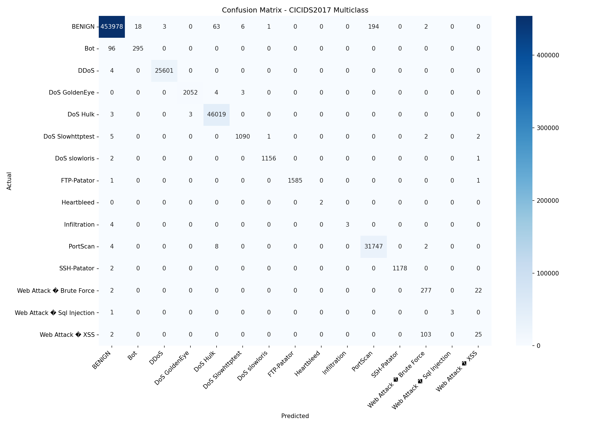
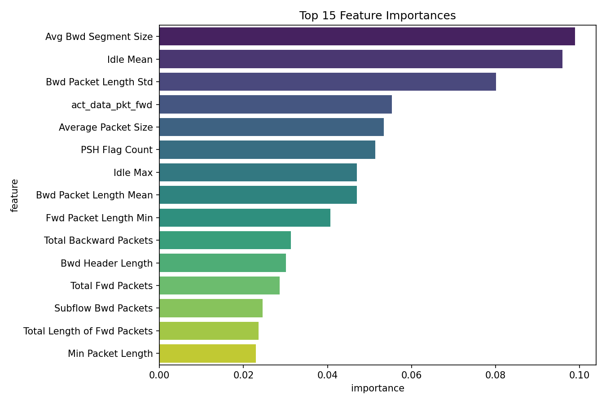

# Intrusion Detection with ML

A multiclass intrusion detection system (IDS) built with **XGBoost** on the [CICIDS2017 dataset](https://www.unb.ca/cic/datasets/ids-2017.html). Classifies network traffic into 15 categories (BENIGN + 14 attack types) with ~99%+ overall accuracy.

---

## Results

| Metric | Score |
|---|---|
| Overall Accuracy | ~99%+ |
| Model | XGBoost (GPU-accelerated) |
| Dataset | CICIDS2017 |
| Train/Test Split | 80/20 stratified |

### Confusion Matrix


### Top 15 Feature Importances


**Strongest classes:** DDoS, DoS Hulk, PortScan, FTP-Patator, SSH-Patator — near-perfect recall.

**Known limitations:** Web Attack XSS and Infiltration have lower recall due to severe class imbalance in the dataset. This is a common challenge with CICIDS2017.

---

## Dataset

**CICIDS2017** — Canadian Institute for Cybersecurity Intrusion Detection dataset.  
Download: https://www.unb.ca/cic/datasets/ids-2017.html  
Place the CSV files in a folder and update the `FOLDER` path in `training.ipynb`.

**Attack classes covered:**
BENIGN, Bot, DDoS, DoS GoldenEye, DoS Hulk, DoS Slowhttptest, DoS slowloris, FTP-Patator, Heartbleed, Infiltration, PortScan, SSH-Patator, Web Attack – Brute Force, Web Attack – SQL Injection, Web Attack – XSS

---

## Setup

### 1. Clone the repo
```bash
git clone https://github.com/YOUR_USERNAME/YOUR_REPO_NAME.git
cd YOUR_REPO_NAME
```

### 2. Install dependencies
```bash
pip install -r requirements.txt
```

> **Note:** Training uses GPU (`device="cuda"`). If you don't have a CUDA-compatible GPU, change that parameter to `device="cpu"` in the notebook — training will just be slower.

### 3. Download the dataset
Download the CICIDS2017 CSV files from the link above and place them all in one folder.

### 4. Update the data path
In `training.ipynb`, update the `FOLDER` variable to point to your dataset folder:
```python
FOLDER = "/path/to/your/MachineLearningCVE"
```

### 5. Run the notebook
```bash
jupyter notebook training.ipynb
```

This will train the model, save it as `ids_model_test2.json`, and output both plots.

---

## Project Structure

```
├── training.ipynb          # Full training pipeline
├── ids_model_test2.json    # Saved XGBoost model
├── confusion_matrix.png    # Evaluation plot
├── feature_importance.png  # Top 15 features plot
├── requirements.txt
└── README.md
```

---

## Model Details

- **Algorithm:** XGBoost (multi-class softmax)
- **Estimators:** 500 trees with early stopping (patience = 20)
- **Max depth:** 4
- **Learning rate:** 0.05
- **Regularization:** L1 = 0.1, L2 = 1.5
- **Subsampling:** 80% rows and columns per tree

---

## Requirements

See `requirements.txt`:
```
xgboost
scikit-learn
pandas
numpy
matplotlib
seaborn
jupyter
```

---

## References

- Sharafaldin, I., Lashkari, A. H., & Ghorbani, A. A. (2018). *Toward Generating a New Intrusion Detection Dataset and Intrusion Traffic Characterization.* ICISSP.
- [CICIDS2017 Dataset](https://www.unb.ca/cic/datasets/ids-2017.html)
